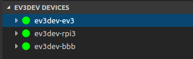

# ev3dev browser for Visual Studio Code

This extension allows you to browse ev3dev devices from Visual Studio Code, send
files to these devices and remotely run programs.

Learn more about ev3dev at <http://www.ev3dev.org>.

## Features

*   **Discover devices**: Any connected ev3dev device should be automatically discovered.
    No configuration necessary.

    

*   **Remotely browse files**: Files for each device are listed just as they are in

    

    Brickman.

*   **Download files to the device**: The current VS Code project can be sent to an
    ev3dev device with a single click.

    

*   **Remotely run programs**: Click any executable file to run it.

    

    Right-clicking works too.

    

    Error messages will be displayed in the output pane.

    

*   **Start a remote SSH session**: You can start an SSH session in the terminal pane
    by right-clicking on a device.

    

## Requirements

This extension is only compatible with **ev3dev-stretch** snapshot images starting
with `2017-07-25`. It will not work with other versions of ev3dev.

## Extension Settings

This extension contributes the following settings:

*   `ev3devBrowser.password`: If you changed the password on your ev3dev device,
     you will need to set the password here.
*   `ev3devBrowser.env`: If you need to set environment variables for running
    remote programs, you can set them here.
*   `ev3devBrowser.sendToDevice.include`: Use this to specify which files to
    included when downloading files to the remote device. Can use glob patterns.
*   `ev3devBrowser.sendToDevice.exclude`: Use this to specify which files to
    exclude when downloading files to the remote device. Can use glob patterns.
*   `ev3devBrowser.sendToDevice.directory`: By default files are downloaded to
    a folder with the same name as the VS Code project. Use this setting to
    save the project files somewhere else. Paths are relative to the `/home/robot`
    directory.

## Known Issues

*   Currently, all downloaded files have the executable bit set.
*   Devices don't disappear from the list on macOS when they are disconnected.
*   Stopping a program only sends `SIGTERM`. If that doesn't actually stop the
    program then it can't be stopped remotely. There is not a way to send
    `SIGKILL` to forcefully stop it.
*   Each SSH terminal session starts a new SSH connection. These could be shared.
