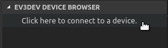
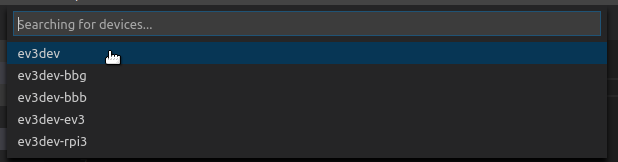
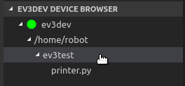
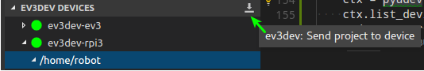
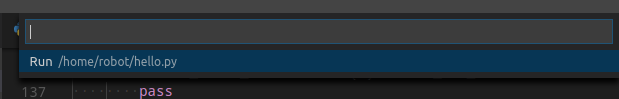
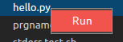
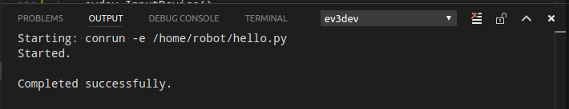
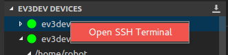
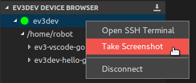
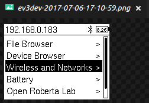

# ev3dev browser for Visual Studio Code

This extension allows you to browse ev3dev devices from Visual Studio Code, send
files to these devices and remotely run programs.

Learn more about ev3dev at <http://www.ev3dev.org>.


## Requirements

This extension is only compatible with devices running **ev3dev-stretch**
[snapshot images] starting with `2017-09-14`. It will not work with other
versions of ev3dev.

Additional information can be found on the [wiki].

[snapshot images]: https://oss.jfrog.org/list/oss-snapshot-local/org/ev3dev/brickstrap/
[wiki]: https://github.com/ev3dev/vscode-ev3dev-browser/wiki


## Features

*   **Discover devices**: Any connected ev3dev device should be automatically discovered.
    No configuration necessary.

    

    

*   **Remotely browse files**: Files for each device are listed just as they are in
    Brickman.

    

*   **Download files to the device**: The current VS Code project can be sent to an
    ev3dev device with a single click.

    

*   **Remotely run programs**: Click any executable file to run it.

    

    Right-clicking works too.

    

    Error messages will be displayed in the output pane.

    

*   **Build, Download and Run with a single click (or <kbd>F5</kbd>)**: Create
    a `launch.json` file with an `"ev3devBrowser"` type to use this feature.

    ```json
    {
        "version": "0.2.0",
        "configurations": [
            {
                "name": "Download and Run",
                "type": "ev3devBrowser",
                "request": "launch",
                "program": "/home/robot/${workspaceRootFolderName}/hello",
                "preLaunchTask": "build"
            }
        ]
    }
    ```


*   **Start a remote SSH session**: You can start an SSH session in the terminal pane
    by right-clicking on a device.

    

*   **Take a screenshot**: You can easily take screenshot by right-clicking
    a device.

    

    


## Extension Settings

This extension contributes the following settings:

*   `ev3devBrowser.password`: If you changed the password on your ev3dev device,
     you will need to set the password here. If you want to manually enter the
     password when you connect or use public key authentication, set this to
     `null`.
*   `ev3devBrowser.env`: If you need to set environment variables for running
    remote programs, you can set them here. Each variable is defined as a
    key/value pair.
*   `ev3devBrowser.download.include`: Use this to specify which files to
    included when downloading files to the remote device. Can use glob patterns.
*   `ev3devBrowser.download.exclude`: Use this to specify which files to
    exclude when downloading files to the remote device. Can use glob patterns.
*   `ev3devBrowser.download.directory`: By default files are downloaded to
    a folder with the same name as the VS Code project. Use this setting to
    save the project files somewhere else. Paths are relative to the `/home/robot`
    directory.
*   `ev3devBrowser.additionalDevices`: A list of additional devices to show in
    the list when connecting to a device. This should only be needed in cases
    where there are network problems interfering with device discover.

More details and examples on the [wiki](https://github.com/ev3dev/vscode-ev3dev-browser/wiki/Settings).
